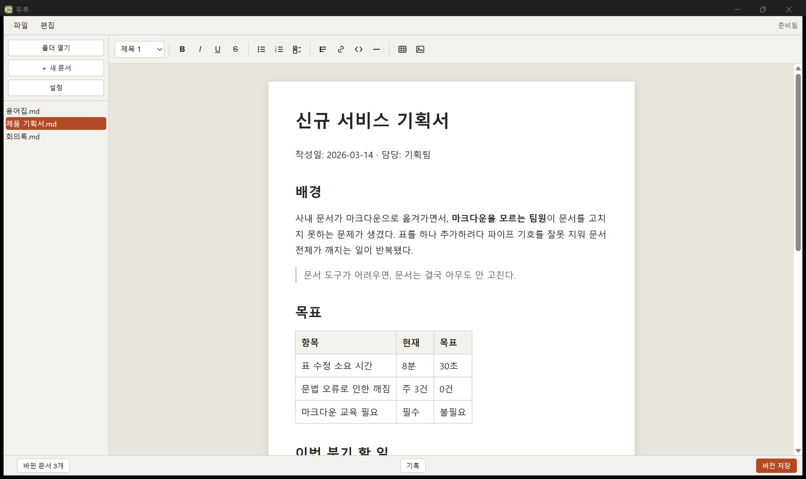
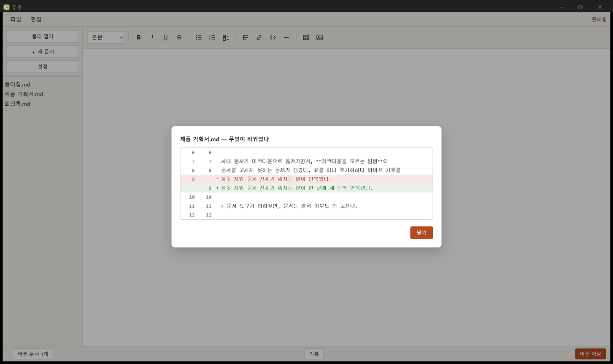

<div align="center">


# 두루 (duru)

**워드처럼 편집했는데, 저장은 깨끗한 마크다운.**

로컬 우선 마크다운 문서 편집기 · Tauri 2

**[소개 사이트 →](https://knox9014.github.io/duru/)**

[English](README.en.md) · [지원 문법 전체 대조표](FEATURE_MAP.md) · [개발 기록](#개발-기록)

</div>

<div align="center">

</div>

---

## 이걸 왜 만들었나

사내 문서가 마크다운으로 옮겨가면서, 정작 **마크다운을 모르는 사람**이 문서를 못 고치게 됐다.
표에 행 하나 추가하려다 `|` 를 잘못 지워 문서 전체가 깨진다. 그래서 아무도 안 고친다.

기존 위지윅 편집기를 쓰면 이번엔 반대 문제가 생긴다.
**자기가 모르는 문법을 조용히 지워버린다.** 사용자는 화면에서 안 보였으니 알아채지도 못한다.

두루는 이 둘 사이를 노린다. 화면에는 `**` 나 `|` 가 보이지 않고,
저장되는 파일은 사람이 읽을 수 있는 평범한 마크다운이다.

## 한 가지 약속

> **워드처럼 편집해도, 문서에 있던 것이 하나도 사라지지 않는다.**

이건 목표가 아니라 측정값이다.
Markdown Guide(Basic + Extended + Hacks) **65개 항목 전부**를 실제 변환 파이프라인에
통과시켜 왕복 검사한 결과 — **소실 0건**.

편집기가 다루지 못하는 문법(각주, 정의 목록 등)도 지우지 않는다.
회색 상자로 얼려서 그대로 보존한 뒤, 저장할 때 원래 글자를 그대로 되돌려 쓴다.

항목별 등급(만들 수 있음 / 고칠 수 있음 / 보존만)은 [FEATURE_MAP.md](FEATURE_MAP.md)에 전부 적혀 있다.

## 할 수 있는 것

| | |
|---|---|
| **표** | 툴바에서 삽입, 셀 클릭해서 입력, 행·열 추가/삭제, 방향키로 셀 이동 |
| **서식** | 굵게·기울임·밑줄·취소선·인라인 코드 (`Ctrl+B` `Ctrl+I` `Ctrl+U`) |
| **목록** | 글머리표·번호·할 일. `Tab`/`Shift+Tab` 으로 중첩, 체크박스는 눌러서 토글 |
| **붙여넣기** | `Ctrl+V` 는 워드·웹·구글 문서의 서식을 살려서, `Ctrl+Shift+V` 는 마크다운으로 해석해서 |
| **이미지** | 파일을 끌어다 놓으면 `assets/` 로 복사하고 상대경로로 링크 |
| **버전** | 문서를 고친 시점을 저장하고, 뭐가 바뀌었는지 색으로 비교 |
| **언어** | 한국어 · English (설정에서 전환) |
| **테마** | 밝게 · 어둡게 · 시스템 설정 따라가기 |
| **업데이트** | 새 버전이 나오면 물어보고, 승낙하면 받아서 설치 (설정에서 끌 수 있음) |

### 두 가지 모드

- **문서 모드** — 한 번에 한 문서. 폴더 구조를 숨기고 파일 목록만 평평하게 보여준다.
- **작업실 모드** — 여러 문서를 탭으로. 폴더 트리가 그대로 보인다.

처음 실행할 때 고르고, 설정에서 언제든 바꾼다.

### 버전 관리 — Git을 몰라도 된다

폴더가 이미 Git 저장소면 하단에 버전 막대가 나타난다.

- **버전 저장** — 지금 상태를 남긴다
- **기록** — 이 문서가 지금까지 어떻게 바뀌어 왔는지
- **바뀐 문서 N개** — 마지막 저장 이후 손댄 문서들

<div align="center">

</div>

한 글자를 고쳐도 **고친 줄만** 바뀐다. 위지윅 편집기가 파일 전체를 다시 쓰는 문제를
정규화로 해결했기 때문이다 (아래 [어떻게 만들어졌나](#어떻게-만들어졌나)).

화면 어디에도 commit·diff·staging 같은 말은 없다.
`.md` 파일과 `assets/` 폴더만 다루고, **저장소를 새로 만들지는 않는다.**

## 실행하기

**[Windows용 설치 파일 내려받기 →](https://github.com/knox9014/duru/releases/latest/download/duru-setup-x64.exe)** (v0.2.0) · [모든 릴리스](https://github.com/knox9014/duru/releases)

> 코드 서명 인증서가 없어서 Windows SmartScreen 경고가 뜬다. **추가 정보 → 실행**을 눌러야 설치된다.

### 직접 빌드하려면

필요한 것 — [Node.js](https://nodejs.org) 20.19+ (또는 22.12+), [Rust](https://rustup.rs) 1.77+, 그리고
버전 관리 기능을 쓰려면 시스템에 `git`.

```bash
npm install
npm run tauri dev          # 개발 모드로 실행
npx tauri build --no-bundle   # 실행 파일만 빌드
```

빌드 결과는 `src-tauri/target/release/duru.exe`.
`--no-bundle` 을 빼면 `bundle/` 아래에 설치 파일(MSI·NSIS)까지 만든다.

Rust 쪽 시험은 `cd src-tauri && cargo test`.

> `package.json` 의 `npm run check` 는 저자 로컬 전용이다. 이 명령이 쓰는 회귀 시험지와
> 검사 스크립트는 저장소에 넣지 않아서, 클론한 환경에서는 동작하지 않는다.
> 측정 결과는 [FEATURE_MAP.md](FEATURE_MAP.md) 에 정리돼 있다.

Windows 11에서 개발·테스트했다. Tauri 특성상 macOS·Linux에서도 빌드는 되겠지만 확인하지 않았다.

## 어떻게 만들어졌나

| 영역 | 선택 |
|---|---|
| 셸 | Tauri 2 (Rust) |
| 화면 | 바닐라 JS — 프레임워크 없음 |
| 글자 입력 | ProseMirror (한글 조합·커서·실행취소) |
| 마크다운 해석 | remark / unified |
| 그 사이 변환 | 직접 구현 (`schema.js` `convert.js` `md.js` `normalize.js`) |
| 버전 관리 | 시스템 `git` 을 인자 배열로 직접 호출 |

**변환 계층을 직접 소유한 이유** — "하나도 사라지지 않는다"를 지키려면 기성 라이브러리에
맡길 수 없었다. 무엇을 어떻게 보존할지가 이 제품의 전부라서.

**파일이 지저분해지는 문제** — 위지윅 편집기는 저장할 때 문서를 자기 방식으로 다시 쓴다.
그대로 두면 한 글자만 고쳐도 파일 전체가 바뀐 것으로 기록된다.
두루는 **처음 열 때 한 번 전체를 정규화**한다. 그 다음부터는 직렬화가 결정론적이라,
안 건드린 부분은 바이트까지 똑같이 재생산된다.
코드 포매터를 처음 도입할 때 첫 커밋만 크고 이후가 조용한 것과 같은 원리다.

## 개발 기록

만들면서 쓴 주차별 기록을 그대로 남겨뒀다. 결정과 그 이유, 틀린 판단까지.

- [SPEC_v0.1.md](docs/SPEC_v0.1.md) — 무엇을 만들지 자른 스펙
- [WEEK1.md](WEEK1.md) · [WEEK2A.md](WEEK2A.md) · [WEEK3.md](WEEK3.md) · [WEEK4.md](WEEK4.md) — 주차별 작업
- [FEATURE_MAP.md](FEATURE_MAP.md) — 문법 65개 항목 측정 결과
- [MODE_PLAN.md](MODE_PLAN.md) — 두 가지 모드를 나눈 이유
- [RESULT.md](RESULT.md) — 검증 결과

## 라이선스

[PolyForm Noncommercial License 1.0.0](LICENSE) — 비상업적 용도로 자유롭게 쓰고 고칠 수 있다.
